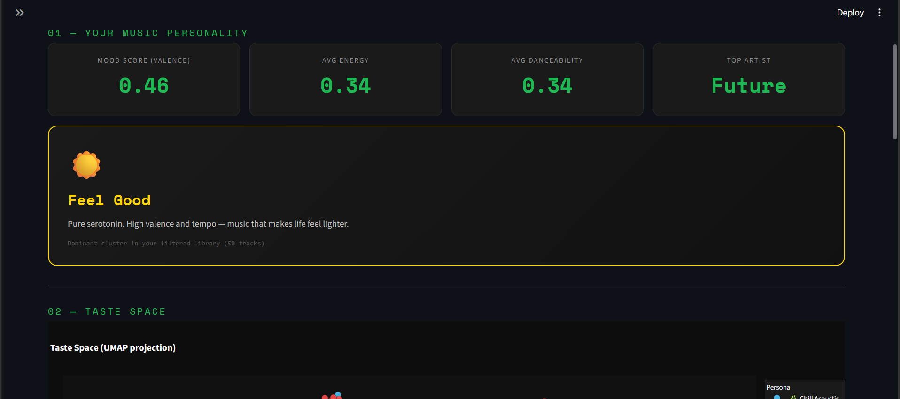
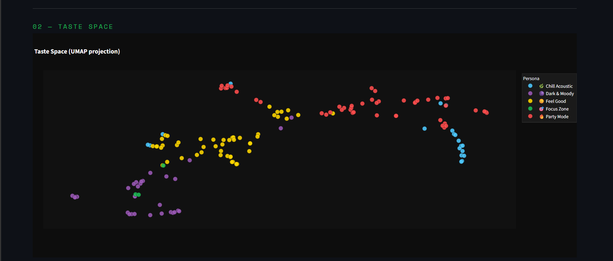
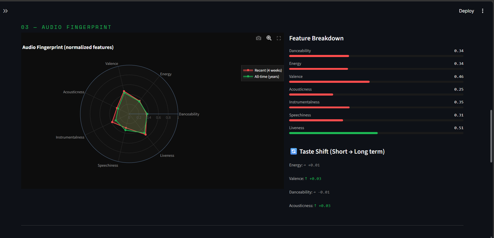
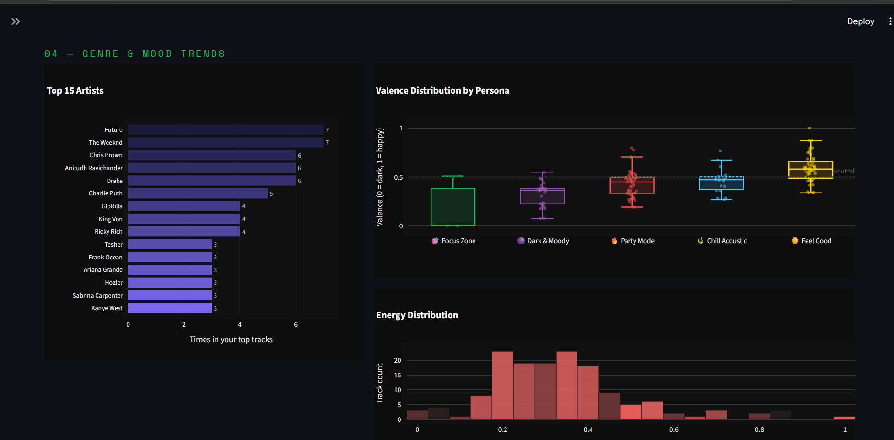

# 🎵 Spotify Music Taste Analyzer

> Analyzed my Spotify listening history to reveal my music personality i.e mood clusters, taste fingerprint, artist breakdown, and listening trends — displayed in an interactive Streamlit dashboard.



---

## ✨ Features

- **Pulls my top tracks** across short (4 weeks), medium (6 months), and long-term (years) from Spotify
- **Last.fm enrichment** — fetches real genre tags for each track to improve audio feature accuracy
- **KMeans clustering** — grouped my music into 5 mood personas
- **UMAP / PCA** — reduced my music taste to a 2D map you can explore
- **Interactive Streamlit dashboard** — fully local, nothing uploaded anywhere

---

## 🎭 Mood Personas

| Persona | Vibe |
|---|---|
| 🔥 Party Mode | High energy + high danceability |
| 🌿 Chill Acoustic | Low energy + high acousticness |
| ☀️ Feel Good | High valence + fast tempo |
| 🌑 Dark & Moody | Low valence + low energy |
| 🎯 Focus Zone | High instrumentalness |

---

## 📸 Dashboard

### 01 — Your Music Personality
Stat cards for mood score, energy, danceability, and top artist. Dominant mood persona with description.


### 02 — Taste Space
2D UMAP scatter of all my fav tracks colored by mood cluster. Hover for track name, artist, valence and energy.



### 03 — Audio Fingerprint
Radar chart comparing my recent (4 weeks) vs all-time audio profile. Feature breakdown bars + taste shift deltas.



### 04 — Genre & Mood Trends
Top 15 artists, valence distribution by persona, energy histogram.



---

## 🚀 Setup

### 1. Spotify Developer Credentials
1. Go to [developer.spotify.com/dashboard](https://developer.spotify.com/dashboard)
2. Create an app — set redirect URI to `http://127.0.0.1:8888/callback`
3. Copy your Client ID and Client Secret

### 2. Last.fm API Key (optional but recommended)
1. Go to [last.fm/api/account/create](https://www.last.fm/api/account/create)
2. Fill in app name + email, submit — you get the key instantly
3. Add to `.env` as `LASTFM_API_KEY`

### 3. Environment File
Create a `.env` file in the project root:
```
SPOTIFY_CLIENT_ID=your_client_id_here
SPOTIFY_CLIENT_SECRET=your_client_secret_here
SPOTIFY_REDIRECT_URI=http://127.0.0.1:8888/callback
LASTFM_API_KEY=your_lastfm_key_here
```

### 4. Install Dependencies
```bash
pip install -r requirements.txt
```

---

## 🏃 Usage

Run each step in order:

```bash
# Step 1 — fetch your Spotify data (opens browser for login on first run)
python fetch_data.py

# Step 2 — enrich with real Last.fm tags (optional but improves accuracy)
python enrich_data.py

# Step 3 — clean and normalize
python preprocess.py

# Step 4 — cluster and reduce dimensions
python analysis.py

# Step 5 — launch the dashboard
python -m streamlit run app.py
```

> **Note:** Steps 3–5 can be re-run anytime without re-fetching from Spotify.

---

## 📁 Project Structure

```
spotify-taste/
├── .env                  # your credentials (never committed)
├── requirements.txt
├── auth.py               # Spotify OAuth flow
├── fetch_data.py         # pulls tracks from Spotify, synthetic fallback on 403
├── enrich_data.py        # fetches real genre tags from Last.fm
├── preprocess.py         # cleans and normalizes data
├── analysis.py           # KMeans clustering, PCA, UMAP, persona assignment
├── app.py                # Streamlit dashboard
├── screenshots/          # dashboard screenshots for README
└── data/                 # auto-created, stores tracks.csv (gitignored)
```

---

## ⚠️ Spotify API Note

Spotify restricted the `/audio-features` and `/artists` endpoints for most developer apps in **late 2024**. If your app hits a 403:

- `fetch_data.py` automatically generates **synthetic audio features** seeded by genre
- Running `enrich_data.py` with a Last.fm key fetches **real genre tags** to significantly improve accuracy
- Clustering and the dashboard work normally either way — a notice is shown when synthetic features are active

---

## 🛠 Tech Stack

`spotipy` · `pandas` · `numpy` · `scikit-learn` · `umap-learn` · `plotly` · `streamlit` · `requests`
